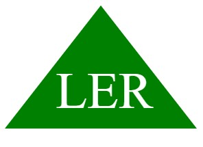

# Command-Line Application to Generate an SVG Logo

This command-line application prompts the user for input to generate an SVG file named `logo.svg` based on the following criteria:

1. Prompt for text input (up to 3 characters)
2. Prompt for text color (keyword or hexadecimal number)
3. Present a list of shapes to choose from (circle, triangle, square)
4. Prompt for shape color (keyword or hexadecimal number)
5. Generate `logo.svg` file
6. Print "Generated logo.svg" in the command line
7. When `logo.svg` file is opened in a browser, it should display a 300x200 pixel image matching the user's criteria.

## How to Use

To use this command-line application, follow these steps:

1. Open a command-line interface.
2. Navigate to the directory where the application is located.
3. Run the application by entering the command `node index.js`.
4. Enter text input when prompted (up to 3 characters).
5. Enter text color when prompted (either a keyword such as "red" or a hexadecimal number such as "#FF0000").
6. Using the up and down keys to navigate, choose a shape option then press enter to select the  shape.
7. Enter the shape color when prompted (either a keyword or a hexadecimal number).
8. Once all prompts have been answered, the `logo.svg` file will be generated in the same directory as the application file and "Generated logo.svg" will be printed in the command line.
9. Open the `logo.svg` file in a web browser to view the generated image.

## Video
[Video Link](https://drive.google.com/file/d/1kjPQA-tOhep2_KyK5ggHUUQLYmmp2RzX/view)

## Technologies
- JavaScript
- Node.js
- Inquirer
- Jest
